# EQ Pro Diagrams

## Architecture Overview
```mermaid
flowchart TB
  UI[PluginEditor + UI Components] -->|APVTS attachments| APVTS[AudioProcessorValueTreeState]
  UI -->|read analyzer/meter| ACCESS[Processor accessors]

  APVTS -->|timerCallback builds| SNAP[ParamSnapshot (double buffer)]
  SNAP -->|atomic swap| PROC[EQProAudioProcessor::processBlock]

  PROC -->|process| ENG[EqEngine]
  ENG --> EQDSP[EQDSP (IIR)]
  ENG --> LP[LinearPhaseEQ (FIR)]
  ENG --> SPEC[SpectralDynamicsDSP]

  ENG --> PRE[AnalyzerTap (pre)]
  ENG --> POST[AnalyzerTap (post)]
  ENG --> METER[MeterTap]

  PRE -->|FIFO read| UI
  POST -->|FIFO read| UI
  METER -->|read state| UI
```

## Threading Model

```mermaid
sequenceDiagram
  participant UI as UI (Message Thread)
  participant PROC as Processor (Audio Thread)
  participant ENG as EqEngine

  UI->>PROC: update APVTS params
  UI->>PROC: timerCallback builds snapshot
  PROC->>PROC: atomic swap snapshot
  PROC->>ENG: process(buffer, snapshot)
  ENG-->>UI: AnalyzerTap/MeterTap data (lock‑free)
```

